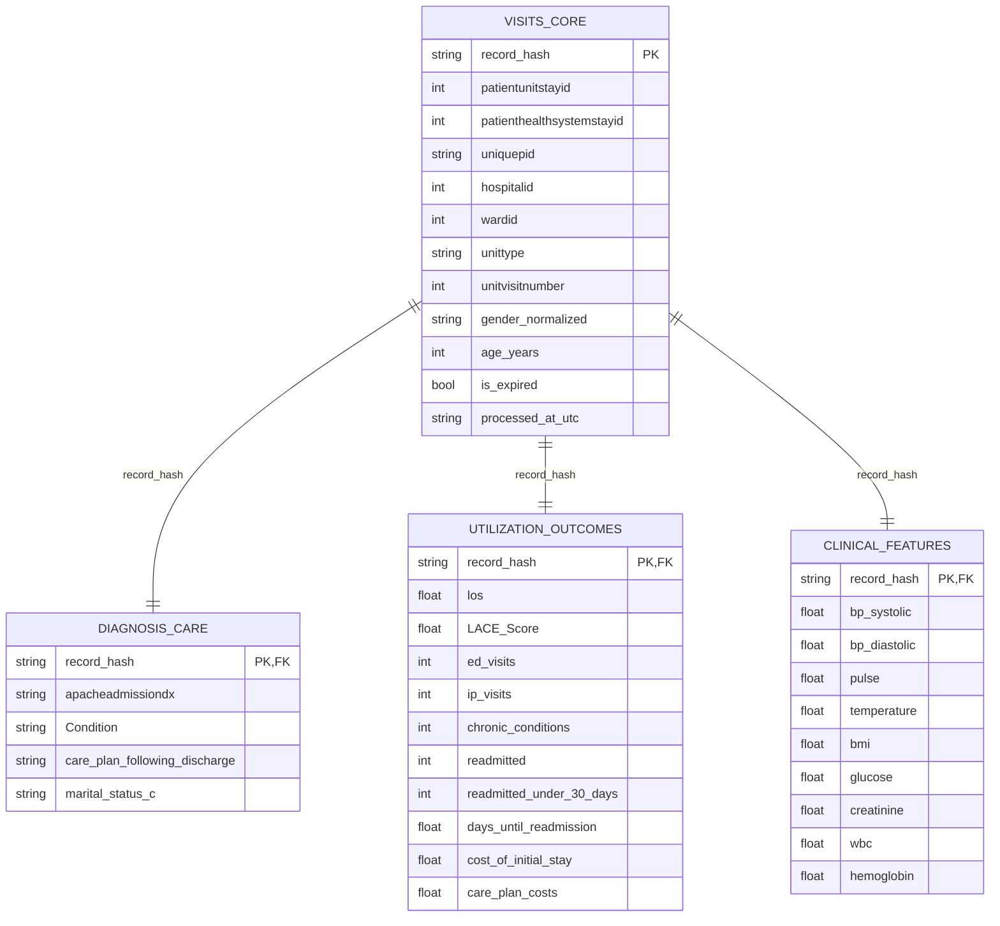
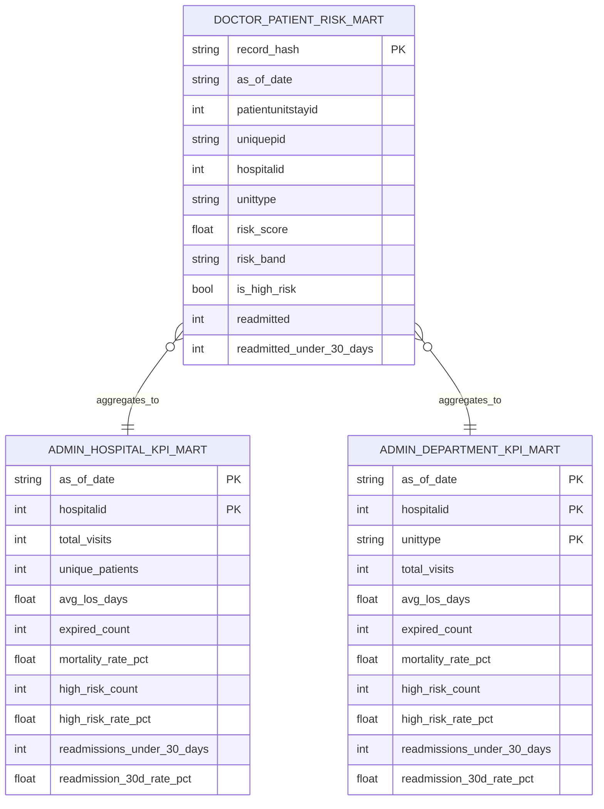

# Patient Readmission Pipeline: Step-by-Step Guide

This guide explains what has been implemented so far, how data flows through the system, and what data is created at each step.

It is written for someone who is new to the project.

---

## 1) Big Picture

The project currently runs an end-to-end pipeline:

1. Generate synthetic EHR-like hospital records.
2. Stage raw records into Bronze (Airbyte-style raw zone).
3. Clean and standardize into Silver.
4. Build persona-focused Gold marts.
5. Visualize quality and analytics in Streamlit.
6. Orchestrate all major steps in Airflow.

---

## 2) Current End-to-End Data Flow

Source (Synthetic CSV generator)
-> Bronze (raw parquet with Airbyte metadata)
-> Silver (cleaned, typed, normalized parquet)
-> Gold (doctor/admin marts)
-> Dashboard / ML / RAG usage

Detailed path flow used today:

- Data/synthetic_ehr.csv
- Data/bronze/airbyte_raw/ehr_visits/load_date=.../load_hour=.../*.parquet
- Data/silver/ehr_visits/visits_core/process_date=.../*.parquet
- Data/silver/ehr_visits/diagnosis_care/process_date=.../*.parquet
- Data/silver/ehr_visits/utilization_outcomes/process_date=.../*.parquet
- Data/silver/ehr_visits/clinical_features/process_date=.../*.parquet
- Data/gold/marts/doctor_patient_risk_mart.parquet
- Data/gold/marts/admin_hospital_kpi_mart.parquet
- Data/gold/marts/admin_department_kpi_mart.parquet

---

## 3) Step-by-Step: What Was Done

## Step 1: Foundation Setup

What was done:

- Created project structure for simulator, ingestion, ETL, dashboard, Airflow, scripts, config, and medallion folders.
- Added environment template and dependency files.

Main artifacts:

- .env.example
- requirements.txt
- src/
- config/
- scripts/
- airflow/
- Data/bronze, Data/silver, Data/gold

What data is generated in this step:

- No business data yet. This step prepares project scaffolding.

---

## Step 2: Source Data Simulation

What was done:

- Built a generator that creates synthetic rows aligned to EHR.csv structure.
- Added options to write to CSV, MongoDB, or both.
- Added Windows scheduler-friendly scripts.

Main code:

- src/simulator/csv_like_generator.py
- src/simulator/csv_writer.py
- src/simulator/run_simulator.py
- src/simulator/mongodb_writer.py

Main output data:

- Data/synthetic_ehr.csv

What data looks like:

- ICU stay ids, demographics, diagnoses, unit/hospital timestamps and offsets, status fields, weights/heights, and identifiers.

---

## Step 3: Bronze Ingestion (Airbyte-Style Staging)

What was done:

- Implemented incremental CSV -> Bronze raw parquet staging.
- Added Airbyte-like metadata columns.
- Added sync state file to avoid reloading old rows.

Main code:

- src/ingestion/airbyte_style_staging.py
- config/airbyte_staging_config.json

Main output data:

- Data/bronze/airbyte_raw/ehr_visits/load_date=YYYY-MM-DD/load_hour=HH/*.parquet
- Data/bronze/_airbyte_state/ehr_visits_state.json

What data is generated in Bronze:

- Raw record columns from source CSV.
- Metadata columns:
  - _airbyte_ab_id
  - _airbyte_emitted_at
  - _airbyte_stream
  - _airbyte_data

---

## Step 4: Bronze -> Silver ETL

What was done:

- Built transformation job to clean and standardize Bronze data.
- Added type casting and normalization.
- Added quality report generation.
- Added incremental processed-file state tracking.

Main code:

- src/etl/bronze_to_silver.py
- config/bronze_to_silver_config.json

Main output data:

- Data/silver/ehr_visits/visits_core/process_date=YYYY-MM-DD/*.parquet
- Data/silver/ehr_visits/diagnosis_care/process_date=YYYY-MM-DD/*.parquet
- Data/silver/ehr_visits/utilization_outcomes/process_date=YYYY-MM-DD/*.parquet
- Data/silver/ehr_visits/clinical_features/process_date=YYYY-MM-DD/*.parquet
- Data/silver/_quality/ehr_visits_quality_report.json
- Data/silver/_state/bronze_to_silver_state.json

Examples of Silver fields added/normalized:

- gender_normalized
- age_years
- hospital_discharge_status_normalized
- unit_discharge_status_normalized
- is_expired
- estimated_unit_los_hours
- record_hash
- processed_at_utc

Silver data model (tables):

- visits_core
  - Grain: one row per visit (`record_hash`)
  - Purpose: identity, encounter context, demographic and status attributes
  - Typical KPI use: visit counts, mortality denominator, patient/hospital/unit segmentation

- diagnosis_care
  - Grain: one row per visit (`record_hash`)
  - Purpose: diagnosis and discharge-care context (`apacheadmissiondx`, `Condition`, `care_plan_following_discharge`)
  - Typical KPI use: condition-level readmission and care pathway analysis

- utilization_outcomes
  - Grain: one row per visit (`record_hash`)
  - Purpose: outcome and utilization signals (`los`, `LACE_Score`, readmission flags, costs, chronic burden)
  - Typical KPI use: readmission rates, LOS trends, high-utilizer and cost KPIs

- clinical_features
  - Grain: one row per visit (`record_hash`)
  - Purpose: labs/vitals/body metrics (`glucose`, `creatinine`, `wbc`, `hemoglobin`, etc.)
  - Typical KPI use: clinical risk slicing and biomarker-based trend analysis

Join key across Silver tables:

- `record_hash` is the canonical key for joining Silver domain tables into Gold marts.

---

## Step 5: Data Quality and EDA Dashboard

What was done:

- Built Streamlit dashboard for Silver quality + exploratory analytics.
- Added filters and multiple charts/KPIs.

Main code:

- src/dashboard/data_quality_eda_app.py
- config/dashboard_config.json
- scripts/run_quality_dashboard.bat

Main dashboard data source:

- Data/silver/ehr_visits/*.parquet
- Data/silver/_quality/ehr_visits_quality_report.json

What dashboard shows:

- Quality summary and null checks
- Mortality and LOS insights
- Distribution and segmentation views
- Throughput trends
- Data completeness

---

## Step 6: Persona Analytics (Gold Marts)

What was done:

- Built Silver -> Gold transformation for persona-ready data.
- Added doctor and admin marts.
- Updated dashboard with Doctor Persona and Admin Persona tabs.
- Added Gold step into Airflow DAG chain.

Main code:

- src/etl/silver_to_gold.py
- config/silver_to_gold_config.json
- scripts/run_silver_to_gold.bat

Main Gold outputs:

- Data/gold/marts/doctor_patient_risk_mart.parquet
- Data/gold/marts/admin_hospital_kpi_mart.parquet
- Data/gold/marts/admin_department_kpi_mart.parquet

What each Gold mart is for:

- doctor_patient_risk_mart: patient-level risk and triage signals for doctors.
- admin_hospital_kpi_mart: hospital-level KPI summary for admin leadership.
- admin_department_kpi_mart: unit/department-level KPI breakdown.

ERD: Silver and Gold

Silver ERD (clean canonical domain tables):

Gold ERD (KPI/dashboard marts):

Interpretation:

- Silver tables are joined by `record_hash` and represent fully cleaned canonical data.
- Gold marts are derived from Silver and optimized for KPI cards, trend charts, and operational dashboards.

---

## Step 7: Gold -> SQL Table Publishing

What was done:

- Built a loader that publishes Gold marts into PostgreSQL SQL tables.
- Uses schema `analytics` for isolation from Airflow metadata tables.

Main code:

- src/etl/gold_to_sql.py
- config/gold_to_sql_config.json
- scripts/run_gold_to_sql.bat

Main SQL outputs:

- analytics.doctor_patient_risk_mart
- analytics.admin_hospital_kpi_mart
- analytics.admin_department_kpi_mart

Current loaded row counts:

- doctor_patient_risk_mart: 2000
- admin_hospital_kpi_mart: 131
- admin_department_kpi_mart: 882

---

## 4) Orchestration (Airflow)

What was done:

- Created Airflow DAG and local Docker runtime setup.
- Added task sequence up to Gold publication.

DAG file:

- airflow/dags/ehr_simulator_to_bronze_dag.py

Current task order:

1. generate_synthetic_csv_batch
2. stage_csv_to_bronze_raw
3. transform_bronze_to_silver
4. transform_silver_to_gold
5. load_gold_to_sql

---

## 5) Current Data Volume (Last Run)

After latest refresh:

- doctor_patient_risk_mart: 2000 rows
- admin_hospital_kpi_mart: 131 rows
- admin_department_kpi_mart: 882 rows

---

## 6) Where To Extract Data For Further Use

For ML models:

- Start with Data/gold/marts/doctor_patient_risk_mart.parquet
- This is patient-level and already has engineered risk-related fields.

For RAG (structured-first prototype):

- Use fields like apacheadmissiondx and other clinical context from doctor mart.
- If you want more raw context, use Silver records including _airbyte_data JSON.

For BI / reporting:

- Use admin_hospital_kpi_mart and admin_department_kpi_mart.

---

## 7) Important Note About Postgres

- The running Postgres service contains Airflow metadata and now also analytics tables under schema `analytics`.
- Keep using schema separation (`public` for Airflow internals, `analytics` for project marts).

You can now use either:

- Parquet marts for file-based processing, or
- SQL tables for BI/model feature extraction.

---

## 8) Quick Run Order (Manual)

From project root:

1. Generate source rows
2. Stage to Bronze
3. Transform to Silver
4. Publish Gold marts
5. Open dashboard

Main commands are already documented in README.md and scripts/*.bat files.

---

## 9) Summary for New Team Members

If you are onboarding:

- Source of truth for modeling right now: Gold parquet marts under Data/gold/marts.
- Quality and operational monitoring: Streamlit dashboard on localhost:8501.
- Pipeline automation: Airflow DAG executes Source -> Bronze -> Silver -> Gold.
- Next major enhancement: publish Gold marts into a dedicated analytics Postgres database for Superset/Power BI.
